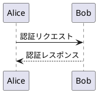

# MarkView - リリースノート

## v1.3.0 - 2025-09-22

### ✨ 新機能

#### 📊 PlantUML図表示機能
- **PlantUMLコードブロック対応**: マークダウン内の`plantuml`、`puml`、`uml`コードブロックを自動で図表として表示
- **リアルタイム図表生成**: PlantUMLサーバーを使用した即座の図表レンダリング
- **多様な図表形式**: シーケンス図、クラス図、アクティビティ図、ユースケース図などをサポート
- **フォールバック機能**: エラー時は元のコードブロックを表示して可読性を保持
- **美しいスタイリング**: 図表に枠線、角丸、パディング、マージンを適用した統一デザイン

### 🔧 改善

#### 技術仕様強化
- **PlantUML専用サービス**: IPlantUmlService/PlantUmlServiceによる専門的な図表処理
- **効率的通信**: Deflate圧縮とPlantUML独自Base64エンコーディングによる最適化
- **正規表現マッチング**: マークダウン内PlantUMLコードブロックの高精度検出
- **依存関係注入**: 新サービスをDIコンテナに統合してアーキテクチャ一貫性を維持

#### PlantUML技術詳細
- **対応言語識別子**: `plantuml`、`puml`、`uml`の3種類をサポート
- **自動タグ補完**: @startuml/@endumlタグの自動補完機能
- **エラーハンドリング**: ネットワークエラーや無効なコード時の安全な処理
- **HTMLエスケープ**: セキュリティを考慮した安全なHTML出力

### 📋 使用方法

#### PlantUML図表作成
1. **コードブロック作成**: ```plantuml で開始
2. **PlantUMLコード記述**: 図表の定義を記述
3. **コードブロック終了**: ``` で終了
4. **自動レンダリング**: 図表が自動的にMarkView内に表示

#### 使用例


---

## v1.2.0 - 2025-09-14

### ✨ 新機能

#### 📁 プロジェクト管理機能
- **プロジェクト作成・管理**: フォルダを選択してプロジェクトとして登録・管理
- **自動ファイル同期**: プロジェクトフォルダ配下のマークダウンファイルを自動検出・同期表示
- **アクティブプロジェクト切り替え**: 現在作業中のプロジェクトを明確に管理・切り替え
- **プロジェクト一覧表示**: 作成済みプロジェクトをサイドバーに整理して表示
- **プロジェクトファイル一覧**: アクティブプロジェクト内のマークダウンファイルを一覧表示

#### ⭐ お気に入り機能
- **お気に入り登録**: 現在開いているマークダウンファイルをワンクリックでお気に入りに追加
- **お気に入り一覧管理**: 登録済みお気に入りをサイドバーに分かりやすく表示
- **アクセス統計記録**: 最終アクセス日時とアクセス回数を自動記録・表示
- **高速アクセス**: お気に入りをダブルクリックで即座にファイルを開く
- **お気に入り削除**: 不要なお気に入りの簡単削除

#### 💾 JSON永続化システム
- **データ自動保存**: プロジェクト・お気に入り情報を`%APPDATA%\MarkView\`に自動保存
- **アプリ再起動時復元**: アプリケーション起動時に自動的にデータを復元
- **安全なデータ管理**: エラーハンドリング付きの安全なJSONデータ読み書き

### 🔧 改善

#### UI・UX向上
- **サイドバータブ追加**: 「プロジェクト」「お気に入り」タブを新たに追加
- **2段構成レイアウト**: プロジェクト一覧とファイル一覧を効率的に配置
- **リアルタイム更新**: アクティブプロジェクト変更時の即座UI反映
- **ステータス表示強化**: アクティブプロジェクト名とファイル数をステータスバーに表示

#### 技術仕様強化
- **MVVM設計完全対応**: ViewModelに新機能用のコマンドとプロパティを適切に配置
- **依存性注入拡張**: 新サービス群をDIコンテナに登録して疎結合を維持
- **非同期処理対応**: ファイル読み込み・データ保存の非同期処理で応答性向上

### 📋 使用方法

#### プロジェクト管理
1. **プロジェクト作成**: サイドバーの「プロジェクト」タブで「新規作成」をクリック
2. **プロジェクト切り替え**: プロジェクト一覧でプロジェクトをダブルクリック
3. **ファイル選択**: アクティブプロジェクトのファイル一覧でファイルをダブルクリック

#### お気に入り管理
1. **お気に入り追加**: マークダウンファイルを開いて「お気に入り」タブで「追加」をクリック
2. **お気に入りアクセス**: お気に入り一覧でファイルをダブルクリック

---

## v1.1.0 - 2025-09-14

### 🐛 修正

#### フォルダ選択時のクラッシュ修正
- **フォルダ選択安定化**: マークダウンファイルを含むフォルダ選択時の強制終了問題を完全解決
- **階層制限機能**: フォルダ読み込み時の階層深度を最大2階層に制限してパフォーマンスを向上
- **ファイル数制限**: 1フォルダあたりの読み込みファイル数を500個、サブディレクトリ数を100個に制限
- **エラーハンドリング強化**: アクセス権限エラー、I/Oエラーなど詳細な例外処理を実装
- **システムフォルダ除外**: 隠しフォルダやシステムフォルダを自動的にスキップして安全性を向上

### 🔧 改善

#### ユーザビリティ向上
- **エラーメッセージ改善**: より具体的で分かりやすいエラーメッセージを表示
- **ステータス表示強化**: フォルダ読み込み状況をリアルタイムで表示
- **デバッグ情報出力**: 開発者向けに詳細なログ出力機能を追加

#### 安定性・パフォーマンス向上
- **メモリ使用量最適化**: 大量のファイルがあるフォルダでもメモリ効率を改善
- **読み込み速度向上**: 不要なファイル処理をスキップして高速化
- **例外処理の網羅性**: 予期しないクラッシュを防ぐ包括的な例外処理

---

## v1.0.0 - 2025-09-14

### ✨ 新機能

#### 📖 マークダウン表示機能
- **高速レンダリング**: Markdig + WebView2によるモダンなマークダウン処理
- **リアルタイムプレビュー**: ファイルを開いた瞬間にレンダリング済みで表示
- **GitHub風スタイリング**: 見慣れた美しいデザインでマークダウンを表示
- **シンタックスハイライト**: コードブロックの美しい構文強調表示

#### 🎨 テーマ・カスタマイズ機能
- **ライト/ダークテーマ**: ワンクリックでテーマを切り替え
- **フォントサイズ調整**: 10px〜24pxまで7段階のフォントサイズ
- **リアルタイム反映**: テーマやフォントサイズの変更を即座に反映

#### 📁 ファイル管理機能
- **ドラッグ&ドロップ対応**: ファイルをウィンドウに投げ込むだけで開ける
- **ファイルブラウザ**: サイドバーでMarkdownファイルを階層表示
- **最近使用したファイル**: 最大10件のファイル履歴を保持
- **フォルダ選択**: まるごとMarkdownフォルダを管理

#### 🗂️ ナビゲーション機能
- **自動目次生成**: 見出しレベル（H1〜H6）に応じたツリー構造の目次
- **目次ジャンプ**: 目次項目をクリックで該当箇所にスムーズスクロール
- **サイドバー切り替え**: 作業領域を広く使えるサイドバー表示/非表示

#### 🔍 検索・操作機能
- **文書内検索**: Ctrl+Fで文書内のテキストを検索
- **印刷機能**: WebView2の印刷ダイアログで高品質印刷
- **キーボードショートカット**: 主要操作のショートカット対応
- **ズーム表示**: 現在のズームレベルをステータスバーに表示

#### 💻 技術仕様
- **.NET 8.0**: 最新の.NETフレームワークを採用
- **WPF + MVVM**: 保守性の高いアーキテクチャ
- **WebView2**: Chromiumベースの最新HTMLレンダリング
- **軽量設計**: 高速起動と低メモリ使用量

### 🎯 対応形式
- `.md` - Markdownファイル
- `.markdown` - Markdownファイル（拡張子違い）
- `.txt` - テキストファイル

### ⌨️ キーボードショートカット
- `Ctrl+O`: ファイルを開く
- `Ctrl+F`: 検索
- `Ctrl+P`: 印刷
- `Ctrl+Plus`: フォントサイズを大きく
- `Ctrl+Minus`: フォントサイズを小さく
- `Ctrl+0`: フォントサイズをリセット
- `Alt+F4`: アプリケーション終了
- `Esc`: 検索パネルを閉じる

### 🎨 UI特徴
- **直感的インターフェース**: Obsidianライクな使いやすさ
- **日本語対応**: 完全日本語化されたメニューとメッセージ
- **レスポンシブデザイン**: ウィンドウサイズに応じた自動調整
- **ステータス表示**: ファイル情報、ズームレベル、動作状況を表示

### 🚀 パフォーマンス
- **高速起動**: 軽量設計による瞬間起動
- **大容量ファイル対応**: 大きなMarkdownファイルもスムーズに表示
- **低メモリ使用**: 効率的なメモリ管理

### 📋 システム要件
- **OS**: Windows 10/11 (.NET 8.0対応)
- **フレームワーク**: .NET 8.0 Desktop Runtime
- **WebView2**: Microsoft Edge WebView2 Runtime

---

## 今後の予定

### v1.1.0（予定）
- 🔧 PDF出力機能
- 🔧 タブ機能（複数ファイル同時表示）
- 🔧 一時メモ機能
- 🔧 設定保存・復元機能

### v1.2.0（予定）
- 🔧 プラグインシステム
- 🔧 カスタムCSS対応
- 🔧 印刷プレビュー機能

---

## フィードバック・サポート

バグ報告や機能要望は以下まで：
- GitHub Issues: このリポジトリのIssues
- 使用方法についてはREADME.mdをご参照ください

**MarkView v1.0.0 - Obsidianのような使いやすさを目指した軽量マークダウンビューア**