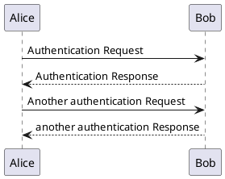
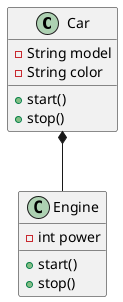

# PlantUML テストファイル

このファイルはPlantUML表示機能のテスト用です。

## シーケンス図のテスト



## クラス図のテスト



## 簡単なアクティビティ図

```uml
@startuml
start
:ユーザーがログインページにアクセス;
:ユーザー名とパスワードを入力;
if (認証成功?) then (yes)
  :メインページに移動;
else (no)
  :エラーメッセージを表示;
endif
stop
@enduml
```

## 通常のコードブロック（PlantUMLではない）

```javascript
function hello() {
    console.log("Hello, World!");
}
```

上記のPlantUMLコードブロックが正しく画像として表示されることを確認してください。